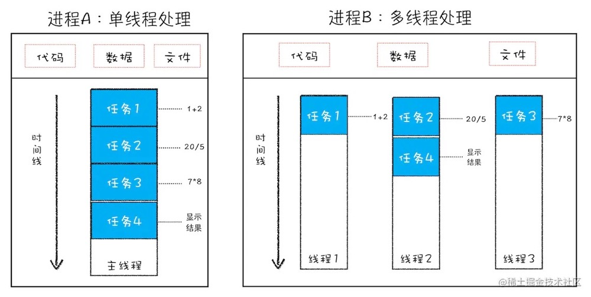
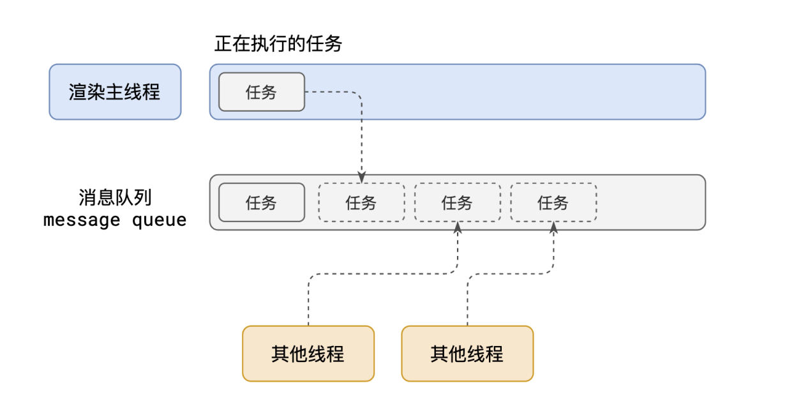
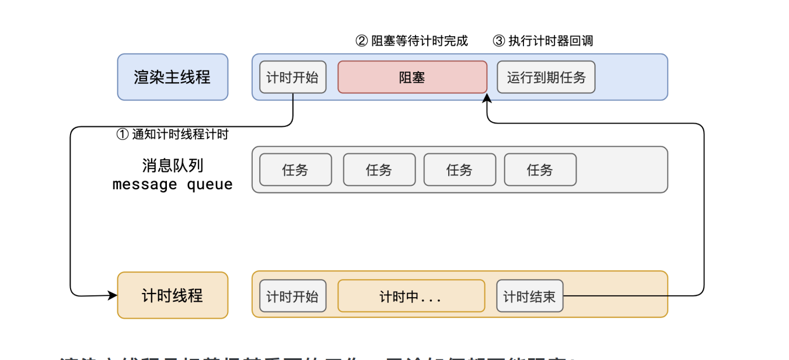
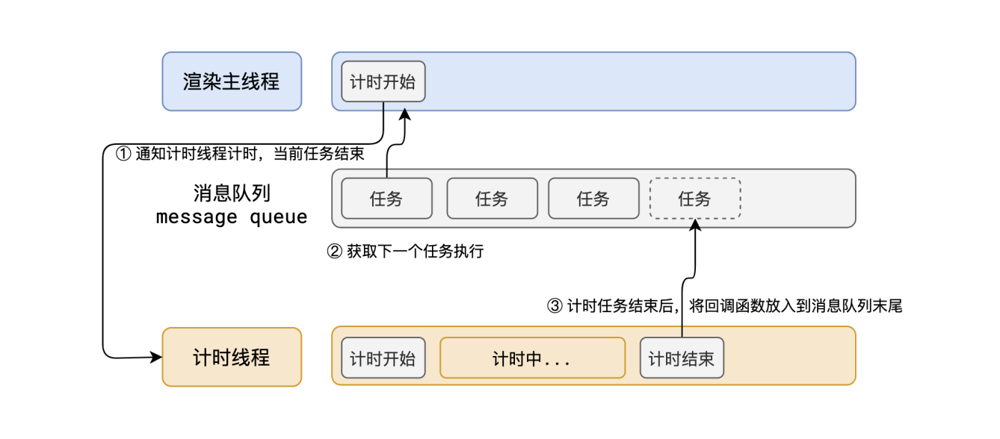

- [什么是进程？](#什么是进程)
- [什么是线程？](#什么是线程)
- [进程与线程关系](#进程与线程关系)
- [IPC(inter-process communication) 进程间通信](#ipcinter-process-communication-进程间通信)
- [浏览器进程](#浏览器进程)
- [渲染主线程](#渲染主线程)
  - [meesageloop](#meesageloop)
- [vue2 中 nexttick](#vue2-中-nexttick)
  - [vue3 中的 nexttick](#vue3-中的-nexttick)
  - [相关文档](#相关文档)
- [js执行机制](#js执行机制)
  - [代码编译](#代码编译)
  - [代码执行阶段](#代码执行阶段)
    - [执行上下文](#执行上下文)
    - [作用域与作用域链](#作用域与作用域链)
    - [闭包](#闭包)
    - [this](#this)
  - [call 、apply 、bind](#call-apply-bind)
    - [call](#call)
    - [apply](#apply)


## 什么是进程？

进程（Process）是计算机中正在运行的程序的实例。当一个程序被执行时，操作系统会为这个程序创建一个进程，并分配一些系统资源（如CPU时间、内存空间等）给这个进程。进程通常包含一个或多个线程（Thread），每个线程执行不同的任务，但是共享进程的资源和内存空间。

在多任务操作系统中，可以同时运行多个进程，每个进程都是独立的、互不干扰的，它们可以并发执行，从而提高计算机的效率和性能。操作系统通过进程调度（Process Scheduling）机制来控制进程的执行，以保证系统的稳定性和效率。

进程具有以下特点：

- 独立性：每个进程都是独立的，有自己的独立的内存空间和系统资源。

- 并发性：多个进程可以同时运行，共享计算机的资源。

- 动态性：进程的创建和销毁是动态的，可以随时创建和销毁。

- 随机性：进程的执行顺序和时间是不确定的，取决于系统的调度算法和各个进程的优先级。

- 系统开销：每个进程都需要占用一定的系统资源，包括内存、CPU时间、I/O等，因此需要合理管理和控制进程的数量和资源占用。


## 什么是线程？

线程（Thread）是计算机中最小的执行单元，是进程中的一个实体，负责程序的执行。一个进程可以包含多个线程，每个线程可以独立执行不同的任务，但是共享进程的资源和内存空间。

线程有以下特点：

- 轻量级：相比进程，线程的开销更小，创建、销毁和切换的速度更快。

- 共享资源：多个线程可以共享进程的资源和内存空间，包括代码、数据、堆栈等。

- 并发性：多个线程可以并发执行，从而提高计算机的效率和性能。

- 随机性：线程的执行顺序和时间是不确定的，取决于系统的调度算法和各个线程的优先级。

- 同步问题：由于多个线程共享同一份数据，因此需要注意同步问题，避免数据竞争和死锁等问题。

线程通常用于实现并发编程，可以同时执行多个任务，提高程序的效率和性能。在多线程编程中，需要注意线程的安全性和同步问题，使用锁、信号量等机制来保证线程的正确性和可靠性。

## 进程与线程关系



1. 线程是依附于进程的，而进程中使用多线程并行处理能提升运算效率。
2. 进程中的任意一线程执行出错，都会导致整个进程的崩溃
3. 线程之间共享进程中的数据。

## IPC(inter-process communication) 进程间通信

todo
<!-- http://c.biancheng.net/view/1208.html -->

## 浏览器进程

打开一个浏览器tab页面将会开启一个浏览器进程、GPU进程、network service、Storage service、Audio service等等...


- 浏览器进程：主要负责界面显示、用户交互、子进程管理，同时提供存储等功能。
- 渲染进程：核心任务是将 HTML、CSS 和 JavaScript 转换为用户可以与之交互的网页，排版引擎 Blink 和 JavaScript 引擎 V8 都是运行在该进程中，默认情况下，Chrome 会为每个 Tab 标签创建一个渲染进程。出于安全考虑，渲染进程都是运行在沙箱模式下。渲染进程启动后，会开启⼀个渲染主线程，主线程负责执⾏ HTML、CSS、JS 代码。

- GPU 进程：其实，Chrome 刚开始发布的时候是没有 GPU 进程的。而 GPU 的使用初衷是为了实现 3D CSS 的效果，只是随后网页、Chrome 的 UI 界面都选择采用 GPU 来绘制，这使得 GPU 成为浏览器普遍的需求。最后，Chrome 在其多进程架构上也引入了 GPU 进程。
- 网络进程：主要负责页面的网络资源加载，之前是作为一个模块运行在浏览器进程里面的，直至最近才独立出来，成为一个单独的进程。
- 插件进程：主要是负责插件的运行，因插件易崩溃，所以需要通过插件进程来隔离，以保证插件进程崩溃不会对浏览器和页面造成影响。


## 渲染主线程

渲染主线程是浏览器中最繁忙的线程，需要它处理的任务包括但不限于：
- 解析 HTML
- 解析 CSS
- 计算样式
- 布局
- 处理图层
- 每秒把⻚⾯画 60 次
- 执⾏全局 JS 代码
- 执⾏事件处理函数
- 执⾏计时器的回调函数


### meesageloop

渲染主线程需要做这么多事情 如何控制事件的顺序呢 --> 排队



  1. 在最开始的时候，渲染主线程会进⼊⼀个⽆限循环
  2. 每⼀次循环会检查消息队列中是否有任务存在。如果有，就取出第⼀个任务执⾏，执⾏完⼀个后进⼊下⼀次循环；如果没有，则进⼊休眠状态。
  3. 其他所有线程（包括其他进程的线程）可以随时向消息队列添加任务。新任务会加到消息队列的末尾。在添加新任务时，如果主线程是休眠状态，则会将其唤醒以继续循环拿取任务。
  这样⼀来，就可以让每个任务有条不紊的、持续的进⾏下去了。
  整个过程，被称之为**事件循环（消息循环）**


在代码处理的过程中，会遇到一些没有办法立即处理的任务，比如：

  - 计时完成后需要执⾏的任务 —— setTimeout 、 setInterval
  - ⽹络通信完成后需要执⾏的任务 -- XHR 、 Fetch
  - ⽤户操作后需要执⾏的任务 -- addEventListener

如果让渲染主线程等待这些任务的时机达到，就会导致主线程⻓期处于「阻塞」的状态，从⽽导致浏览器「卡死」



浏览器选择异步来解决这个问题,借助 message queue



任务是没有优先级的，在消息队列中 **先进先出**。但是消息队列是有**优先级**的。
根据 W3C 的最新解释:
- 每个任务都有⼀个任务类型，同⼀个类型的任务必须在⼀个队列，不同类型
的任务可以分属于不同的队列。
在⼀次事件循环中，浏览器可以根据实际情况从不同的队列中取出任务执
⾏。
- 浏览器必须准备好⼀个微队列，微队列中的任务优先所有其他任务执⾏。

在⽬前 chrome 的实现中，⾄少包含了下⾯的队列：
- 延时队列：⽤于存放计时器到达后的回调任务，优先级「中」
- 交互队列：⽤于存放⽤户操作后产⽣的事件处理任务，优先级「⾼」
- 微队列：⽤户存放需要最快执⾏的任务，优先级「最⾼」

## vue2 中 nexttick

Here we have async deferring wrappers using microtasks. 使用微任务的异步延迟包装器。

nexttick 利用任务队列中微任务优先级高的特点

1. 在 nexttick 中，首先会判断 环境是否支持 promise
```js
  if (typeof Promise !== 'undefined' && isNative(Promise)) {
  const p = Promise.resolve()
  timerFunc = () => {
    p.then(flushCallbacks)
    // In problematic UIWebViews, Promise.then doesn't completely break, but
    // it can get stuck in a weird state where callbacks are pushed into the
    // microtask queue but the queue isn't being flushed, until the browser
    // needs to do some other work, e.g. handle a timer. Therefore we can
    // "force" the microtask queue to be flushed by adding an empty timer.
    if (isIOS) setTimeout(noop)
  }
  isUsingMicroTask = true
} 
```

2. 如果不支持，则判断是否支持 MutationObserver

```js
// MutationObserver is unreliable in IE11
else if (
  !isIE &&
  typeof MutationObserver !== 'undefined' &&
  (isNative(MutationObserver) ||
    // PhantomJS and iOS 7.x
    MutationObserver.toString() === '[object MutationObserverConstructor]')
) {
  // Use MutationObserver where native Promise is not available,
  // e.g. PhantomJS, iOS7, Android 4.4
  // (#6466 MutationObserver is unreliable in IE11)
  let counter = 1
  const observer = new MutationObserver(flushCallbacks)
  const textNode = document.createTextNode(String(counter))
  observer.observe(textNode, {
    characterData: true
  })
  timerFunc = () => {
    counter = (counter + 1) % 2
    textNode.data = String(counter)
  }
  isUsingMicroTask = true
} 
```

3. 如果也不支持 MutationObserver 则采用 宏任务 setImmediate 兜底，先判断是否支持 setImmediategit

```JS
else if (typeof setImmediate !== 'undefined' && isNative(setImmediate)) {
  // Fallback to setImmediate.
  // Technically it leverages the (macro) task queue,
  // but it is still a better choice than setTimeout.
  timerFunc = () => {
    setImmediate(flushCallbacks)
  }
} 

```

4. 如果都不支持，最后是 setTimeout兜底

```js

timerFunc = () => {
    setTimeout(flushCallbacks, 0)
  }
```


### vue3 中的 nexttick 

Vue 3 中的 nextTick 方法时，它会返回一个 Promise 对象。Vue 3 会在 Promise 的 then 方法中执行回调函数，而这个 then 方法会被加入到微任务队列中。当主线程中的任务执行完毕后，会立即执行微任务队列中的任务，这时就会执行 nextTick 的回调函数。

Vue 3 还会利用浏览器原生的 queueMicrotask 方法，将 nextTick 的回调函数放入微任务队列中。这样可以确保回调函数在 DOM 更新周期之后执行，但是在下一个事件循环之前执行。这样可以避免在同一个事件循环中执行太多的任务，从而提高性能。


### 相关文档

[MutationObserver mdn](https://developer.mozilla.org/zh-CN/docs/Web/API/MutationObserver)


## js执行机制

js代码先编译，再执行，所以分两个阶段：

1. 代码编译阶段：将代码翻译成可执行代码。
2. 代码执行阶段：创建执行上下文、执行代码、垃圾回收。

### 代码编译

V8需要将JS编译成字节码或者二进制代码，在此之间有几个过程：

- 词法分析、语法分析
- 确定作用域规则
- 生成可执行代码


### 代码执行阶段

#### 执行上下文

执行上下文也称为**调用栈**，是JS引擎用于追踪函数执行以及函数间*调用关系*的机制，通过栈这种数据结构记录了在程序中的位置。

js是单线程语言，只有一个调用栈，主要做的事情是：进入函数，js引擎把该函数的执行上下文压栈，从函数中返回（函数调用结束）则将执行上下文出栈。

执行上下文分三种：

1. 全局上下文 （js执行首先被压入栈）
2. 函数执行上下文：函数被调用时，进入当前函数执行上下文
3. eval 执行上下文

当一个函数被激活时（也就是被调用），一个新的执行上下文将会被创建，一个执行上下文的生命周期分为两个阶段：

- 创建阶段：创建变量对象vo、建立作用域链、确定this。
- 代码执行阶段：变量赋值、函数引用、 执行其他代码。

创建阶段：

1. 变量对象
   
| 变量对象 Variable Object，简称 VO 进入执行阶段，变量对象变成活动对象 Active Object , 简称 AO。

VO创建有几个过程：

- 建立arguments对象：当前上下文中的参数，建立该对象下的属性与属性值。
- 检查当前上下文的函数声明
  - 寻找 function 函数（函数声明）加属性名到变量对象中，属性值指向该函数的内存地址。
  - 遇到同名的function函数声明，属性会被新的引用覆盖。
  - 函数表达式不会被提升，相当于变量声明。
- 检查当前上下文中的变量声明：
  - 每找到一个变量声明，就添加到变量对象中，属性值为`undefined`
  - 遇到同名属性会跳过，可防止同名函数被修改为`undefined`，同一个执行上下文中，变量对象是唯一的（有可能在代码执行阶段被修改赋值）。
  - `const/let` 声明的变量，也会被收集到变量对象中，但不会赋值`undefined`，所以不能再赋值前调用，也就是常说的暂时性死区，如果访问了，报错`Uncaugth ReferenceError: Cannot access [变量名] before initialization`。

VO对象创建完后，需要进入执行阶段才能访问属性，进入执行阶段，变量对象转变为活动对象，属性能访问，开始执行该阶段的操作：

- 变量赋值（按顺序赋值、会覆盖）
- 函数引用
- 执行其他代码

执行阶段，JS引擎开始按顺序一行一行的执行，遇到变量会按顺序赋值，遇见一个赋值语句就覆盖一个属性，包括函数名、不同类型的值。

例子：

```js
function test() {
    console.log(foo);
    console.log(bar);

    function foo() {}
	  foo = 'Hello';
    var bar = function() {}
    console.log(foo)
    console.log(bar)
 }
test();

  // 一、创建阶段，创建变量对象
  VO = {
    arguments: {...},
    foo: <foo reference>, //优先函数声明，碰到变量foo不会被覆盖，var声明的变量当遇到同名的属性时，会跳过而不会覆盖
    bar: underfined // 函数表达式 -> 当做变量声明处理
  }

  // 二、执行阶段，VO => AO，按顺序赋值，逐一覆盖
  AO = {
    arguments: {...},
    foo: 'Hello', // 执行阶段按顺序进行赋值或者引用
    bar: <bar reference>,
  }

  // 预编辑伪代码
  function test() {
      // 1、创建变量对象阶段
      var foo;
      foo => function foo() {} //一等公民函数，优先声明，并指向函数的引用地址
      var bar : underfined

      // 2、代码执行阶段: 变量赋值，函数引用, 全部按照顺序来
      console.log(foo); // 函数引用
      console.log(bar); // underfined
      // 按顺序执行到这里，重新给变量foo赋值
      foo = 'Hello';
      console.log(foo); // 'Hello'
      bar = function () {
      return 'world';
    }
  }
```

变量提升具有两个问题：

1. 变量容易被覆盖
2. 本应销毁的变量没有被销毁

例如：

```js
function foo(){ 
  for (var i = 0; i < 7; i++) {
  } 
  console.log(i); 
}
foo() // i打印7

```

按道理 for循环结束后 i应该被销毁，但是并没有，能够打印出i的值
这是变量提升的杰作，在创建执行上下文的阶段，变量i就被提升了，所以for循环结束后，i不会被销毁
为了尽可能避开`变量提升`这个JS的设计缺陷，ES6用`let/const`引入了块级作用域（之前JS只有`全局作用域`和`函数作用域`两种）

块级作用域：块级作用域就是使用一对大括号包裹的一段代码，比如函数、判断语句、循环语句，甚至单独的一个{}都可以被看作是一个块级作用域，大部分语言都支持块级作用域。

例如：

```js
function foo(){
    var a = 1
    let b = 2
    {
      let b = 3
      var c = 4 // 用var，即使在{}块里，也会被提升
      let d = 5
      console.log(a)
      console.log(b)
    }
    console.log(b) 
    console.log(c)
    console.log(d)
}   
foo()
```

编辑并创建执行上下文如下图:


- var声明的变量，全部被提取到变量对象里
- let/const声明的变量，放到词法环境里
- 函数作用域块内部用let声明的变量，并没有存放到词法环境

然后执行代码阶段，先执行到内部代码块：


词法环境里维护了一个小型的栈结构，在不同块级作用域通过let/const声明的变量会有进栈出栈的行为。

具体查找顺序：词法环境的栈顶开始 -> 词法环境的某个块级 -> 变量对象


可以了解词法环境的结构和工作机制:

1. 块级作用域是通过词法环境的栈结构来实现的
2. 变量提升是通过变量环境来实现 通过这两者的结合，JavaScript 引擎也就同时支持了变量提升和块级作用域了


#### 作用域与作用域链

执行上下文中，除了有变量对象，还有作用域链和this

作用域是一套规则，作用域链是作用域的具体实现.

每个函数的执行上下文都会通过进栈出栈的形式来执行，在每个执行上下文的变量环境中，包含了一个外部引用outer，用来指向外部的执行上下文。

如果JS引擎在当前执行上下文中找不到某个变量，就会继续在outer指向的执行上下文中查找，一直到全局的执行上下文，这个查找链条称为**作用域链**。

```js
function bar() {
  // 跟定义环境有关
 console.log(myName)
}
function foo() {
    var myName = "极客邦"
    bar()
}
var myName = "极客时间"
foo()

```


在上面块级作用域中就使用了作用域链

在JS执行过程中，作用域链是由词法作用域决定的，而词法作用域是由代码中*函数声明的位置*决定的，在代码编译阶段就决定的静态作用域，跟函数怎么调用没有关系。


通过作用域查找变量的链接称为作用域链，作用域链是通过词法作用域确定的，它反应了代码的结构.

#### 闭包

例如：

```js
function foo() {
  var a = 2;
  function bar() {
    console.log(a);
  }
  return bar;
}
var baz = foo();
baz();
```

作用域链：Local -> Closure(foo) -> Global

给闭包一个定义：在执行上下文A中创建了函数B，当B执行时访问了A中的变量（即使A已经执行结束，执行上下文已出栈），这些变量会保存在内存中，这些变量的集合成为闭包

用上面的例子来解释：foo函数创建了bar函数，根据词法作用域的规则，bar总是可以访问它的外部函数foo中的变量，即使foo函数已经执行结束，通过bar函数依然能访问到foo函数的内部变量a，a不会随着foo函数执行上下文的销毁而销毁，而是生成Closure(foo)，被保存在了内存中。

#### this

JS的作用域机制并不支持在对象内部方法中使用自身内部属性，所以需要额外搞出一套This机制，它跟作用域链是两套系统，没有太多联系

this分一下四种：


```js
var name = "window name"
var obj = {
  name : "obj name", 
  showThis: function(){
    console.log(this.name)
    function bar(){ 
		console.log(this.name) 
	  }
    bar()
  }
}
obj.showThis()
// 第一个this执行obj对象 -> 这个容易理解
// 第二个，bar里面的this -> 指向window对象，容易误以为继承外面的this

```

这是this的设计缺陷之一：嵌套函数中的this不会继承外层函数的this 解决方法有两种:

- ES6的箭头函数：箭头函数不会创建自身的执行上下文，它的this取决于外部函数（也可以说它无this）
- 在外层函数声明变量self来保存this -> 把this体系转换为作用域的体系

this的设计缺陷二：普通函数中的this指向全局对象window 常见的解决办法：
- 用call、apply显示调用某个对象


### call 、apply 、bind


#### call

| call() 方法在使用一个指定的 this 值和若干个指定的参数值的前提下调用某个函数或方法。

如果函数不在严格模式下，如果第一个参数是 null 和 undefined 将被替换为全局对象，并且*原始值*将被转换为对象。

使用：

```js
function a() {
  console.log(arguments, this.name);
}
var obj = {
  name: 'lizhi'
}
a()
a.call(obj, 'age', 'sex') // this 指向了 obj，并且函数执行了，多个参数也传到了a中。
```

实现思路：将函数设为对象的属性、执行该函数、删除该函数

```js

Function.prototype.customCall = function(context, ...args) {
  let context = context
  // 处理 null 和 undefined
  if ([null, undefined].includes(context)) {
    context = window
  }
  // 如果是原始值例如 string、number，举例string
  if(typeof context === 'string') {
    context = new String(context)
  }
  context.fn = this
  console.log(arguments); // 获取customCall参数，第一个是传入的函数，需要取后续的
  context.fn(...args) //剩余参数传递
  delete context.fn
}

```

#### apply

apply和call的区别在于 apply 第二参数接受数组或者类数组

```js
Function.prototype.myApply = function(context, args) {
  let context = context
  // 处理 null 和 undefined
  if ([null, undefined].includes(context)) {
    context = window
  }
  // 如果是原始值例如 string、number，举例string
  if(typeof context === 'string') {
    context = new String(context)
  }
  context.fn = this
  context.fn(args) //剩余参数传递
  delete context.fn
}
```