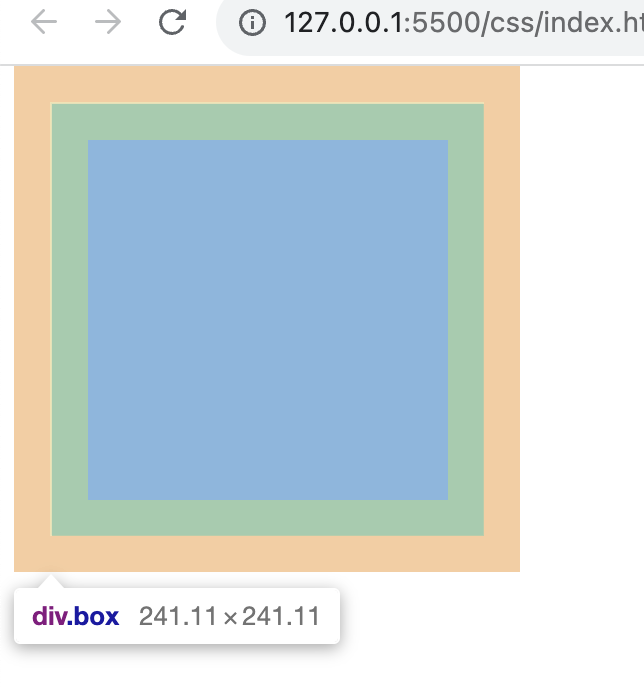
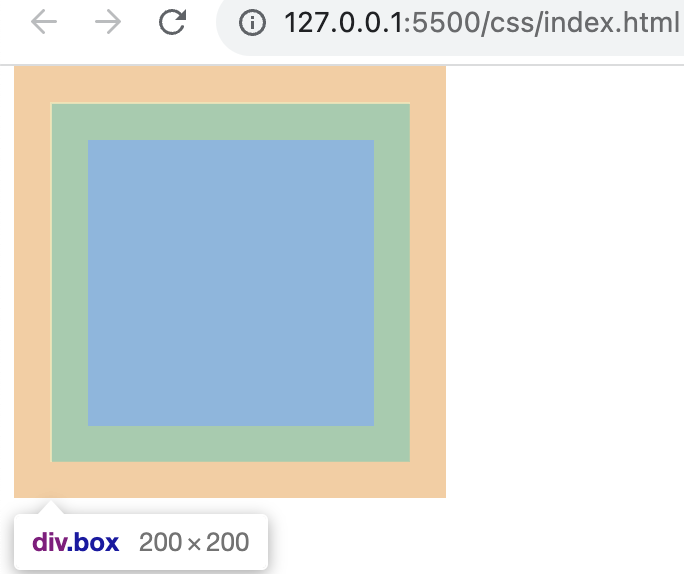

# 一些稀碎的基础

- [一些稀碎的基础](#一些稀碎的基础)
  - [继承属性](#继承属性)
  - [居中几种方式](#居中几种方式)
    - [水平居中](#水平居中)
    - [垂直居中](#垂直居中)
  - [页面导入样式时，link和@import有什么区别](#页面导入样式时link和import有什么区别)
  - [盒模型](#盒模型)
  - [元素隐藏的几种方式](#元素隐藏的几种方式)
  - [position](#position)
  - [css 选择器和优先级](#css-选择器和优先级)

## 继承属性

在css中，继承是指的是给父元素设置一些属性，后代元素会自动拥有这些属性

- 字体系列

```css
font:组合字体
font-family:规定元素的字体系列
font-weight:设置字体的粗细
font-size:设置字体的尺寸
font-style:定义字体的风格
font-variant:偏大或偏小的字体
```

- 文本属性

> 文本属性：vertical-align、text-decoration 不被继承

```css
text-indent：文本缩进
text-align：文本水平对刘
line-height：行高
word-spacing：增加或减少单词间的空白
letter-spacing：增加或减少字符间的空白
text-transform：控制文本大小写
direction：规定文本的书写方向
color：文本颜色
```

- 元素可见性

```css
visibility
```


- 表格布局属性

```css
caption-side：定位表格标题位置
border-collapse：合并表格边框
border-spacing：设置相邻单元格的边框间的距离
empty-cells：单元格的边框的出现与消失
table-layout：表格的宽度由什么决定
```

- 列表属性

```css
list-style-type：文字前面的小点点样式
list-style-position：小点点位置
list-style：以上的属性可通过这属性集合
```

- 引用

```css
quotes：设置嵌套引用的引号类型
```

- 光标属性

```css
cursor：箭头可以变成需要的形状
```

- [参考](https://juejin.cn/post/7107820079470870565#heading-2)

## 居中几种方式

### 水平居中

- 行内元素

```css
.parent {
    text-align: center;
}
```

- 块元素

```css
.son {
  margin: 0 auto;
  width: 300px;
}
```

- 子元素含 float

```css
.parent{
    width:fit-content;
    margin:0 auto;
}

.son {
    float: left;
}
```

- flex弹性盒子

- 绝对定位

1. transform

2. left/right: 0
```css
.son {
    position: absolute;
    width: 宽度;
    left: 0;
    right: 0;
    margin: 0 auto;
}
```

### 垂直居中

- 行内元素

```css
.parent {
    height: 高度;
}

.son {
    line-height: 高度;
}
```
局限：单行文本，子元素line-height 为父元素的height值


- table

```css
.parent {
  display: table;
}
.son {
  display: table-cell;
  vertical-align: middle;
}
```

- flex布局

- 绝对定位

1. transform

2. top/bottom: 0; 


## 页面导入样式时，link和@import有什么区别

   区别：
   1. link是HTML标签，@import是css提供的。
   2. link引入的样式页面加载时同时加载，@import引入的样式需等页面加载完成后再加载。
   3. link没有兼容性问题，@import不兼容ie5以下。
   4. link可以通过js操作DOM动态引入样式表改变样式，而@import不可以。
   5. @import这个使用的方法，它必须得在<style></style>或者css文件中使用

link

   link 引入样式会**阻塞**页面的渲染。当浏览器解析 HTML 文档时，遇到 link 标签会发起样式表的下载请求，直到该样式表下载完成并解析完毕后，才会继续解析 HTML 文档和渲染页面。

   如果页面中有多个 link 标签引入的样式表，则浏览器会按照 link 标签的顺序依次下载和解析这些样式表，这可能会导致页面渲染的延迟和阻塞。

   为了减少页面渲染的阻塞，可以使用以下方法：

   1. 将 link 标签放在 HTML 文档的底部，这样可以先渲染页面的内容，然后再加载样式表。这样可以减少页面渲染的延迟时间，提高用户体验。
   2. 使用 rel="preload" 属性来指示浏览器预加载样式表，这样可以在页面渲染之前预先下载样式表，提高页面渲染的速度。
   3. 使用内联样式（inline style）来减少样式表的数量和大小，这样可以减少样式表的下载时间和解析时间，提高页面渲染的速度。但是这种方式不适用于大型网站，因为内联样式会增加 HTML 文档的大小，降低页面的性能和可维护性。


## 盒模型

两种盒子模型都是由 `content + padding + border + margin` 构成，其大小都是由 `content + padding + border` 决定的，但是盒子内容宽/高度（即 width/height）的计算范围根据盒模型的不同会有所不同：

标准盒模型：只包含 content 。
IE（替代）盒模型：content + padding + border 。

例如：一个盒子样式

```css
.box {
  width: 200px;
  height: 200px;
  border: 1px solid #dcdcdc;
  background-color: lightblue;
  margin: 20px;
  padding: 20px;
}
```

- content-box(W3C 标准盒模型)



width = content + padding + border
width = 1px + 20px + 200px

- border-box((IE 盒模型))



width =  content(padding + width + border)
width = 200px

## 元素隐藏的几种方式

- overflow:hidden 隐藏除宽高外的内容

- opacity:0 占地了，可以点击

- visibility:hidden 占地了，但看不见

- display:none 不占地，也看不见

## position

- absolute 绝对定位，脱离文档流，相对于父级元素。
- relative 相对定位，不脱离文档流，参考自身静态位置定位。
- fixed 固定定位，这里他所固定的对象是浏览器可视窗口而并非是body或是父级元素。
- sticky: 粘性定位，相当于relative 和 fixed 的结合，元素在跨越特定阈值前为相对定位，之后为固定定位。适用于顶部导航栏、标题、操作栏、底部评论等。


## css 选择器和优先级

内联 > id选择器 > 类选择器、属性选择器（a[href="https://example.org"]）、伪类（:first-child） > 标签选择器（h1,a,div） 和 伪元素（::before,::after）


优先级是由 A 、B、C、D 的值来决定的

如果存在内联样式，那么 A = 1，否则 A = 0 ；
B 的值等于 ID选择器（#id） 出现的次数；
C 的值等于 类选择器（.class） 和 属性选择器（a[href="https://example.org"]） 和 伪类（:first-child） 出现的总次数；
D 的值等于 标签选择器（h1,a,div） 和 伪元素（::before,::after） 出现的总次数。


从左到右比较，如果都相等，后面覆盖前面的
