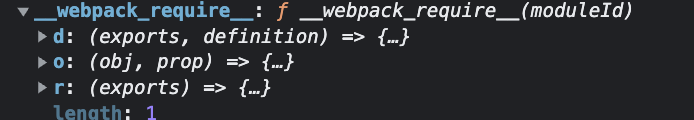
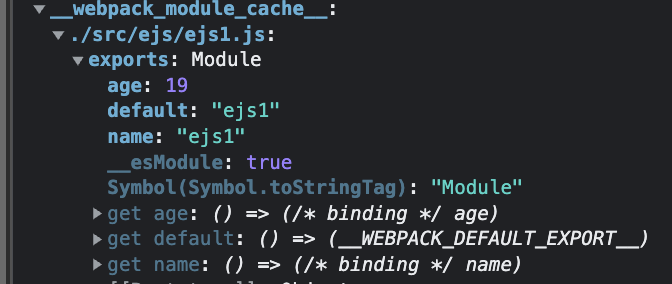

```m
project
└───src
│   |____modlues    // es module 、 cjs

```

## cjs

打包后的文件：

- **webpack_modules**
  模块列表

- **webpack_module_cache**
  缓存的模块集合

- **webpack_require**
  webpack 加载模块的方法

## ejs

相比 cjs，webpack 为 webpack_require 增加了三个方法

- `__webpack_require__.d`
  定义属性获取器

- `__webpack_require__.o`
  判断是否含该属性

- `__webpack_require__.r`
  表示 es 模块

现在的 **webpack_require**





## import()
