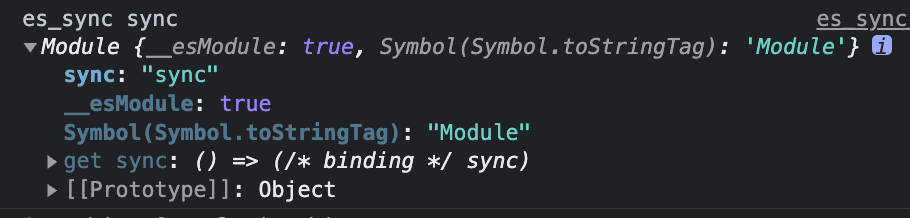
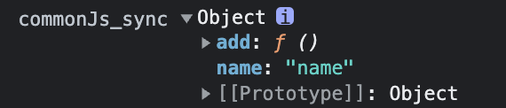

- [webpack 模块化处理](#webpack-模块化处理)
  - [esModule 与 commonJs](#esmodule-与-commonjs)
  - [webpack处理两种模块](#webpack处理两种模块)
    - [处理 es module](#处理-es-module)
    - [对于commonJs的处理](#对于commonjs的处理)
    - [对异步加载模块的处理](#对异步加载模块的处理)
  - [参考文章](#参考文章)


# webpack 模块化处理

Webpack 天生支持如下模块类型：

- ECMAScript 模块
- CommonJS 模块
- AMD 模块
- Assets（资源模块(asset module)是一种模块类型，它允许使用资源文件（字体，图标等）而无需配置额外 loader。）
- WebAssembly 模块

webpack会将这些模块处理成统一格式的模块。

> webpack如何做到支持`commonjs`、`es module`。
## esModule 与 commonJs


## webpack处理两种模块

### 处理 es module

处理 `es module` 增加了 __webpack_require__，__webpack_require__.o，__webpack_require__.r方法

如何做到import导入的状态同步: 通过对导入的模块属性定义getter方法并且绑定在exports上，会把所有的值都挂载引用模块导出的，调用的时候通过作用域链可以获取变化的值

- __webpack_require__.d： d 是 definePropertyGetters 的缩写；用来定义getter属性； 对导出的模块的属性在 exports 对象上定义一个 key value，key 为模块名称，value 为模块的可执行函数。
- __webpack_require__.o： o 是 hasOwnProperty 的缩写；判断对象是否有该属性；
- __webpack_require__.r： r 是 makeNamespaceObject 的缩写；主要是标识该模块为es模块。

```JS
/******/ 	/* webpack/runtime/define property getters */
/******/ 	(() => {
/******/ 		// define getter functions for harmony exports
/******/ 		__webpack_require__.d = (exports, definition) => {
/******/ 			for(var key in definition) {
/******/ 				if(__webpack_require__.o(definition, key) && !__webpack_require__.o(exports, key)) {
/******/ 					Object.defineProperty(exports, key, { enumerable: true, get: definition[key] });
/******/ 				}
/******/ 			}
/******/ 		};
/******/ 	})();
/******/ 	
/******/ 	/* webpack/runtime/hasOwnProperty shorthand */
/******/ 	(() => {
/******/ 		__webpack_require__.o = (obj, prop) => (Object.prototype.hasOwnProperty.call(obj, prop))
/******/ 	})();
/******/ 	
/******/ 	/* webpack/runtime/make namespace object */
/******/ 	(() => {
/******/ 		// define __esModule on exports
/******/ 		__webpack_require__.r = (exports) => {
/******/ 			if(typeof Symbol !== 'undefined' && Symbol.toStringTag) {
/******/ 				Object.defineProperty(exports, Symbol.toStringTag, { value: 'Module' });
/******/ 			}
/******/ 			Object.defineProperty(exports, '__esModule', { value: true });
/******/ 		};
/******/ 	})();
/******/ 	
```

源文件：
```js
export let sync = 'sync';
```

编译后：
```js
/***/ "./src/es_sync.js":
/*!************************!*\
  !*** ./src/es_sync.js ***!
  \************************/
/***/ ((__unused_webpack_module, __webpack_exports__, __webpack_require__) => {
// eval("__webpack_require__.r(__webpack_exports__);\n/* harmony export */ __webpack_require__.d(__webpack_exports__, {\n/* harmony export */   \"sync\": () => (/* binding */ sync)\n/* harmony export */ });\nlet sync = 'sync';\n\n//# sourceURL=webpack://webpack-async/./src/es_sync.js?");
__webpack_require__.r(__webpack_exports__);
/* harmony export */ __webpack_require__.d(__webpack_exports__, {
/* harmony export */   "sync": () => (/* binding */ sync)
/* harmony export */ });
let sync = 'sync';

/***/ }),

```

源文件
```js
import { sync } from './es_sync';
console.log('es_sync', sync);
```

```js
(() => {
__webpack_require__.r(__webpack_exports__);
/* harmony import */ var _es_sync__WEBPACK_IMPORTED_MODULE_0__ = __webpack_require__('./src/es_sync.js');

console.log('es_sync', _es_sync__WEBPACK_IMPORTED_MODULE_0__.sync);

})();
```

`_es_sync__WEBPACK_IMPORTED_MODULE_0__` ：



### 对于commonJs的处理 

抛出的属性仅仅是赋值

```js
/***/ "./src/commonJs_sync.js":
/*!******************************!*\
  !*** ./src/commonJs_sync.js ***!
  \******************************/
/***/ ((module) => {

// eval("module.exports.name = 'name'\n\nmodule.exports.add = function(){\n  return 'add'\n}\n\n// var count = 1;\n\n// setTimeout(() => {\n//   count ++\n// }, 1000)\n\n// module.exports.count = count\n\n//# sourceURL=webpack://webpack-async/./src/commonJs_sync.js?");
module.exports.name = 'name'

module.exports.add = function(){
  return 'add'
}

/***/ }),

```
```js
// This entry need to be wrapped in an IIFE because it need to be isolated against other modules in the chunk.
(() => {
const sync = __webpack_require__("./src/commonJs_sync.js");
console.log('commonJs_sync', sync);

})();

```

`sync`:



输出的是结果

### 对异步加载模块的处理

过程：
1. 通过chunkId 判断是否已加载完成(installedChunks 中状态是否为 0)
2. 未加载 则调用 `__webpack_require__.l` 加载生成script 并且插入页面中加载文件。
3. 加载的chunk会立即执行 `webpackJsonpCallback` 方法 。
4. webpackJsonpCallback 方法会将 installedChunks 中对应的chunkId的状态值改为已加载完成， 并且将模块的数据 合并到主 `__webpack_modules__`中。

问题：
1. 导入相同的模块如何处理。
引入相同的模块，chunkId相同，在 `installedChunks` 中 判断是否有该chunkId存在。如果有 则不调用 加载脚本方法。


增加了:
  - __webpack_require__.m：m 是 moduleFactories 的缩写；对__webpack_modules__的引用；
  - __webpack_require__.e：e 是 ensureChunk 的缩写； 加载异步 chunk 的方法；
  - __webpack_require__.u： u 是 getChunkScriptFilename 的缩写；获取加载chunk资源脚本部分的文件名（由ouput.chunkFilename配置确定)
  - __webpack_require__.l： l 是 loadScript 的缩写； 用来加载script标签；
  - __webpack_require__.p： p 是 publicPath 的缩写；获取公共路径（由output.publicPath配置确定）；
  - __webpack_require__.f.j： f 是 ensureChunkHandlers 的缩写；加载chunk的JSONP方法。

```js
// 原文件
import('./async').then(val => {
    console.log('async', val.async);
});

// 编译后
__webpack_require__.e("src_async_js")
  .then(__webpack_require__.bind(__webpack_require__, "./src/async.js"))
  .then(val => {console.log('async', val.async);});
```

根据编译后的结果进行逐行分析：

1. `__webpack_require__.e("src_async_js")`

```js
/******/ 	/* webpack/runtime/ensure chunk */
/******/ 	(() => {
/******/ 		__webpack_require__.f = {};
/******/ 		// This file contains only the entry chunk.
/******/ 		// The chunk loading function for additional chunks
/******/ 		__webpack_require__.e = (chunkId) => {
/******/ 			return Promise.all(Object.keys(__webpack_require__.f).reduce((promises, key) => {
              // 此时 __webpack_require__.f 上面只有 __webpack_require__.f.j方法 
              // 相当于调用了 __webpack_require__.f.j方法将 chunkId 和 promises数组传入
/******/ 				__webpack_require__.f[key](chunkId, promises);
/******/ 				return promises;
/******/ 			}, []));
/******/ 		};
/******/ 	})();
```

```js
/******/ 	/* webpack/runtime/jsonp chunk loading */
/******/ 	(() => {
/******/ 		// no baseURI
/******/ 		
/******/ 		// object to store loaded and loading chunks
/******/ 		// undefined = chunk not loaded, null = chunk preloaded/prefetched
/******/ 		// [resolve, reject, Promise] = chunk loading, 0 = chunk loaded
            // 安装的chunk集合
            // key为 chunkId
            // value 为 0代表 加载完成，[resolve, reject, Promise]代表加载中， undefined代表未加载
/******/ 		var installedChunks = {
/******/ 			"async_index": 0
/******/ 		};
/******/ 		
/******/ 		__webpack_require__.f.j = (chunkId, promises) => {
/******/ 				// JSONP chunk loading for javascript
//              __webpack_require__.o = (obj, prop) => (Object.prototype.hasOwnProperty.call(obj, prop))
/******/ 				var installedChunkData = __webpack_require__.o(installedChunks, chunkId) ? installedChunks[chunkId] : undefined;
/******/ 				if(installedChunkData !== 0) { // 0 means "already installed".
/******/ 		
/******/ 					// a Promise means "currently loading".
/******/ 					if(installedChunkData) {
/******/ 						promises.push(installedChunkData[2]);
/******/ 					} else {
/******/ 						if(true) { // all chunks have JS
/******/ 							// setup Promise in chunk cache
/******/ 							var promise = new Promise((resolve, reject) => (installedChunkData = installedChunks[chunkId] = [resolve, reject]));
/******/ 							promises.push(installedChunkData[2] = promise);
/******/ 		
/******/ 							// start chunk loading
/******/ 							var url = __webpack_require__.p + __webpack_require__.u(chunkId);
/******/ 							// create error before stack unwound to get useful stacktrace later
/******/ 							var error = new Error();
/******/ 							var loadingEnded = (event) => {
/******/ 								if(__webpack_require__.o(installedChunks, chunkId)) {
/******/ 									installedChunkData = installedChunks[chunkId];
/******/ 									if(installedChunkData !== 0) installedChunks[chunkId] = undefined;
/******/ 									if(installedChunkData) {
/******/ 										var errorType = event && (event.type === 'load' ? 'missing' : event.type);
/******/ 										var realSrc = event && event.target && event.target.src;
/******/ 										error.message = 'Loading chunk ' + chunkId + ' failed.\n(' + errorType + ': ' + realSrc + ')';
/******/ 										error.name = 'ChunkLoadError';
/******/ 										error.type = errorType;
/******/ 										error.request = realSrc;
/******/ 										installedChunkData[1](error);
/******/ 									}
/******/ 								}
/******/ 							};
/******/ 							__webpack_require__.l(url, loadingEnded, "chunk-" + chunkId, chunkId);
/******/ 						} else installedChunks[chunkId] = 0;
/******/ 					}
/******/ 				}
/******/ 		};

/******/ 		// install a JSONP callback for chunk loading
/******/ 		var webpackJsonpCallback = (parentChunkLoadingFunction, data) => {
/******/ 			var [chunkIds, moreModules, runtime] = data;
/******/ 			// add "moreModules" to the modules object,
/******/ 			// then flag all "chunkIds" as loaded and fire callback
/******/ 			var moduleId, chunkId, i = 0;
/******/ 			if(chunkIds.some((id) => (installedChunks[id] !== 0))) {
/******/ 				for(moduleId in moreModules) {
/******/ 					if(__webpack_require__.o(moreModules, moduleId)) {
/******/ 						__webpack_require__.m[moduleId] = moreModules[moduleId]; // 合并到 主 modules
/******/ 					}
/******/ 				}
/******/ 				if(runtime) var result = runtime(__webpack_require__);
/******/ 			}
/******/ 			if(parentChunkLoadingFunction) parentChunkLoadingFunction(data);
/******/ 			for(;i < chunkIds.length; i++) {
/******/ 				chunkId = chunkIds[i];
/******/ 				if(__webpack_require__.o(installedChunks, chunkId) && installedChunks[chunkId]) {
/******/ 					installedChunks[chunkId][0](); // reslove
/******/ 				}
/******/ 				installedChunks[chunkId] = 0;
/******/ 			}
/******/ 		
/******/ 		}
/******/ 		
/******/ 		var chunkLoadingGlobal = self["webpackChunkwebpack_async"] = self["webpackChunkwebpack_async"] || [];
/******/ 		chunkLoadingGlobal.forEach(webpackJsonpCallback.bind(null, 0));
/******/ 		chunkLoadingGlobal.push = webpackJsonpCallback.bind(null, chunkLoadingGlobal.push.bind(chunkLoadingGlobal));
/******/ 	})();

```

```js
/******/ 	/* webpack/runtime/load script */
/******/ 	(() => {
/******/ 		var inProgress = {};
/******/ 		var dataWebpackPrefix = "webpack-async:";
/******/ 		// loadScript function to load a script via script tag
/******/ 		__webpack_require__.l = (url, done, key, chunkId) => {
/******/ 			if(inProgress[url]) { inProgress[url].push(done); return; }
/******/ 			var script, needAttach;
/******/ 			if(key !== undefined) {
/******/ 				var scripts = document.getElementsByTagName("script");
/******/ 				for(var i = 0; i < scripts.length; i++) {
/******/ 					var s = scripts[i];
//                判断是否存在
/******/ 					if(s.getAttribute("src") == url || s.getAttribute("data-webpack") == dataWebpackPrefix + key) { script = s; break; }
/******/ 				}
/******/ 			}
/******/ 			if(!script) {
/******/ 				needAttach = true;
/******/ 				script = document.createElement('script');
/******/ 		
/******/ 				script.charset = 'utf-8';
/******/ 				script.timeout = 120;
/******/ 				if (__webpack_require__.nc) {
/******/ 					script.setAttribute("nonce", __webpack_require__.nc);
/******/ 				}
/******/ 				script.setAttribute("data-webpack", dataWebpackPrefix + key);
/******/ 				script.src = url;
/******/ 			}
/******/ 			inProgress[url] = [done];
/******/ 			var onScriptComplete = (prev, event) => {
/******/ 				// avoid mem leaks in IE.
/******/ 				script.onerror = script.onload = null;
/******/ 				clearTimeout(timeout);
/******/ 				var doneFns = inProgress[url];
/******/ 				delete inProgress[url];
/******/ 				script.parentNode && script.parentNode.removeChild(script);
/******/ 				doneFns && doneFns.forEach((fn) => (fn(event)));
/******/ 				if(prev) return prev(event);
/******/ 			};
/******/ 			var timeout = setTimeout(onScriptComplete.bind(null, undefined, { type: 'timeout', target: script }), 120000);
/******/ 			script.onerror = onScriptComplete.bind(null, script.onerror);
/******/ 			script.onload = onScriptComplete.bind(null, script.onload);
/******/ 			needAttach && document.head.appendChild(script);
/******/ 		};
/******/ 	})();
```

1. script执行完 加载脚本例如
2. chunk调用了 self["webpackChunkwebpack_async"]的push方法也就是 注册的`webpackJsonpCallback`
3. webpackJsonpCallback 中将 当前加载的chunk的`promise`状态改掉。
```js
"use strict";
(self["webpackChunkwebpack_async"] = self["webpackChunkwebpack_async"] || []).push([['src_async_js'],{

/***/  "./src/async.js":
/***/ ((__unused_webpack_module, __webpack_exports__, __webpack_require__) => {

__webpack_require__.r(__webpack_exports__);
/* harmony export */ __webpack_require__.d(__webpack_exports__, {
/* harmony export */   "async": () => (/* binding */ async)
/* harmony export */ });
const async = 'async';

/***/ })

}]);

```


## 参考文章

- [1](https://juejin.cn/post/7072542295144267812)
- [2](https://juejin.cn/post/7152516872330543141)
- [3](https://github.com/lq782655835/blogs/issues/56)